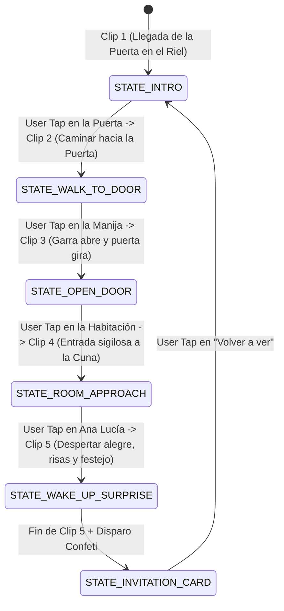

# Especificación Técnica de Software (SDD - Spec-Driven Development)
## Proyecto: Invitación Web Interactiva - Cumpleaños 1 Año "Ana Lucía" (Temática Monsters, Inc. - Video-Driven Experience)

**Versión:** 2.0.0  
**Fecha:** 2026-09-04  
**Enfoque:** Spec-Driven Development (SDD) / Hybrid Video + FSM + Mobile-First Experience  
**Ubicación de proyecto:** `C:\PROYECTOS\InvitacionMonsterInc`

---

## 1. Visión General y Objetivos del Sistema

### 1.1 Propósito
Desarrollar una experiencia web interactiva cinemática (**Mobile-First**) basada en **clips de video cortos / animaciones renderizadas de alta calidad** para cada una de las escenas y acciones clave de la historia (POV de Sulley), combinada con la **Máquina de Estados (FSM)** que detiene el video en momentos clave de interacción (*interactive pauses / cues*) y avanza al siguiente clip tras el toque/clic del usuario, finalizando con la tarjeta oficial de invitación con efecto *glassmorphism*.

### 1.2 Principios de Diseño y Rendimiento
- **Formato:** Exclusivamente optimizado para pantallas móviles (proporción 9:16 / `100dvh`, con contenedor simulador centrado en escritorio).
- **Control de Clips / Transiciones:**
  - Los clips se reproducen de forma fluida y se pausan en fotogramas de decisión o se encadenan mediante la FSM.
  - Soporte para videos optimizados en formato `.mp4` / `.webm` (H.264 / VP9 / AV1) con carga progresiva (*preload="auto"*), `playsinline`, `muted` por defecto para cumplir con las políticas de autoplay de iOS/Android, y activación de audio sincronizado al interactuar.
- **Interactividad Intuitiva:** En cada punto de pausa, surge un indicador táctil pulsante (*"Toca la puerta"*, *"Gira la manija"*, *"Acércate a Ana Lucía"*, *"¡Sorpresa!"*).

---

## 2. Arquitectura de Video + FSM

```
+-------------------------------------------------------------+
|                  Capa de Presentación (UI/UX)               |
|  Indicadores Táctiles + Tarjeta de Invitación Glassmorphism  |
+-------------------------------------------------------------+
|               Capa de Reproducción y Control de Video        |
|    HTML5 Video Player (Multi-clip seamless / Video Timeline)|
+-------------------------------------------------------------+
|                 Capa de Audio & Efectos (FX)                |
|       Pistas de Audio en Video + Web Audio FX + Confeti     |
+-------------------------------------------------------------+
|                 Máquina de Estados de la App                |
|      FSM (Controlador de Escenas, Clips y Puntos de Pausa)  |
+-------------------------------------------------------------+
```

---

## 3. Máquina de Estados y Desglose de Clips de Video



### 3.1 Detalle de Escenas y Videos:

1. **`STATE_INTRO` (Clip 1: Estación de Puertas Monsters Inc)**
   - **Video/Acción:** La puerta de flores blancas y rosas llega a la estación industrial (como en la imagen de referencia). La luz roja superior parpadea suavemente.
   - **Pausa interactiva:** Se detiene en el frame de reposo con las garras de Sulley visibles.
   - **CTA:** *"Toca la puerta para acercarte"*.

2. **`STATE_WALK_TO_DOOR` (Clip 2: Pasos en Primera Persona)**
   - **Video/Acción:** Movimiento de cámara subjetivo avanzando 3 pasos pesados hasta posicionar la manija dorada en primer plano.
   - **Pausa interactiva:** Se detiene frente a la manija dorada.
   - **CTA:** *"Gira la manija para abrir"*.

3. **`STATE_OPEN_DOOR` (Clip 3: Apertura 3D de la Puerta)**
   - **Video/Acción:** La garra de Sulley entra a cuadro, gira la manija dorada y empuja la puerta hacia adentro, revelando una luz mágica hacia la habitación nocturna.
   - **Pausa interactiva:** Se detiene mostrando la habitación con la cuna al fondo.
   - **CTA:** *"Acércate a la cumpleañera"*.

4. **`STATE_ROOM_APPROACH` (Clip 4: Acercamiento a la Cuna)**
   - **Video/Acción:** La cámara se desliza suavemente dentro de la habitación hacia la cuna donde descansa Ana Lucía.
   - **Pausa interactiva:** Primer plano de la bebé durmiendo plácidamente con sus coletas estilo Boo.
   - **CTA:** *"¡Toca a Ana Lucía para darle su sorpresa!"*.

5. **`STATE_WAKE_UP_SURPRISE` (Clip 5: ¡Sorpresa y Risas de Cumpleaños!)**
   - **Video/Acción:** Ana Lucía abre los ojos sonriente, Sulley festeja con un gorro de fiesta y confeti en pantalla.
   - **Finalización:** Al terminar el clip, se dispara la lluvia de confeti en vivo sobre la pantalla y emerge la tarjeta de invitación.

6. **`STATE_INVITATION_CARD` (Tarjeta Final Glassmorphism)**
   - **Visual:** Tarjeta de identificación oficial de Monsters Inc con todos los detalles de la fiesta (Fecha, Hora, Salón, Botón WhatsApp, Botón Google Maps y Calendario).
